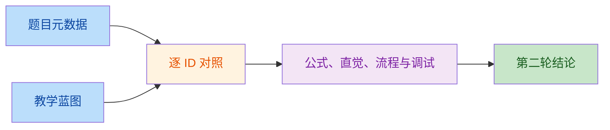

# CNN / RNN 教学蓝图审查（10072-10091）

## 审查口径

- `易读`：标题与原始题目主题一致；`易学`：直觉适合初学者；`易调试`：`debugTip` 能检查明确中间量；`公式`：语义正确、贴合主题，并与原始 data 示例自洽；`步骤`：`flow` 连续且可观察。
- 任一检查项为 `FAIL`，该 ID 的结论即为 `FAIL`。

## 逐项结论

| ID | 易读 | 易学 | 易调试 | 公式 | 步骤 | 结论 | 备注 |
|---:|:---:|:---:|:---:|:---:|:---:|:---:|---|
| 10072 | PASS | PASS | PASS | PASS | PASS | PASS | 标题、局部点积直觉及四步卷积过程一致；patch、核切片、乘积和偏置均可直接核验。 |
| 10073 | PASS | PASS | PASS | PASS | PASS | PASS | 尺寸公式与窗口放置过程正确；逐轴参数和最后窗口起点是明确中间量。 |
| 10074 | PASS | PASS | PASS | PASS | PASS | PASS | 有效核尺寸与稀疏采样语义正确；`D=2` 的九个坐标可直接复核。 |
| 10075 | PASS | PASS | PASS | FAIL | PASS | FAIL | 蓝图公式本身正确，但 data 示例未给 `P` 却声称 `4, K=3, S=2` 得 7；按默认 `P=0` 应得 9，只有补充 `P=1` 才得 7。 |
| 10076 | PASS | PASS | PASS | PASS | PASS | PASS | depthwise 与 pointwise 的拆分、计算量和两个中间张量均清楚；公式已由调试提示限定 depth multiplier 为 1。 |
| 10077 | PASS | PASS | PASS | PASS | PASS | PASS | 分组、独立卷积、拼接连续；置零单组输入可验证通道隔离。 |
| 10078 | PASS | PASS | PASS | PASS | PASS | PASS | 残差与投影捷径均覆盖；相加前 shape 和两支范数可定位问题。 |
| 10079 | PASS | PASS | PASS | PASS | PASS | PASS | 多尺度并行分支到通道拼接一致；分支空间尺寸与通道总数可核验。 |
| 10080 | PASS | PASS | PASS | PASS | PASS | PASS | 时间窗口、跨通道乘加和并行输出连贯；采样索引与单点输出可手算。 |
| 10081 | PASS | PASS | PASS | FAIL | FAIL | FAIL | 蓝图递推对 data 的三层示例算得 `r=9`，data 写成 10；flow 又从输出回溯却采用输入到输出递推，并在覆盖增量前先更新跳距，顺序不清。 |
| 10082 | PASS | PASS | PASS | PASS | PASS | PASS | 两路线性项、预激活与 `tanh` 状态更新完整，且各中间量可逐项检查。 |
| 10083 | PASS | PASS | PASS | PASS | PASS | PASS | 从初始状态到逐时刻递推、输出堆叠连续；逐步调用可与整序列调用对照。 |
| 10084 | PASS | PASS | PASS | FAIL | PASS | FAIL | 雅可比是矩阵，因子不可交换；当前 `\prod_{k=t+1}^{T}` 未定义连乘方向，初学者可能按错误次序理解。 |
| 10085 | PASS | PASS | PASS | PASS | PASS | PASS | 三门、候选记忆、细胞状态与隐藏状态关系正确；两项状态贡献可直接求和验证。 |
| 10086 | PASS | PASS | PASS | PASS | PASS | PASS | 单偏置向量约定下参数公式正确，并明确提示了双偏置框架的修正量。 |
| 10087 | PASS | PASS | PASS | PASS | PASS | PASS | 前后向状态的计算、时间对齐和 concat 融合连续；shape 与 `2h` 可核验。 |
| 10088 | PASS | PASS | PASS | PASS | PASS | PASS | 经典固定上下文 Seq2Seq 的编码、自回归解码与教师强制边界表达清楚。 |
| 10089 | PASS | PASS | PASS | PASS | PASS | PASS | CTC 路径映射、概率求和和负对数语义正确；短样例枚举可独立校验 DP。 |
| 10090 | PASS | PASS | PASS | PASS | PASS | PASS | Bahdanau 打分、softmax、加权上下文到预测连续；权重和与上下文均可核验。 |
| 10091 | PASS | PASS | PASS | PASS | FAIL | FAIL | flow 在 dropout/LayerNorm 前就“屏蔽损失”，不符合前向后再计算损失的执行顺序；data 也未提供生成 mask 所需的真实长度或 padding mask。 |

## BLOCKERS

1. **10075**：在 data 示例中补充 `padding=1`，或把输出改为 `9x9`；否则示例与蓝图的正确尺寸公式冲突。
2. **10081**：把 data 示例结果由 10 改为 9；flow 应统一为从输入层以 `r_0=j_0=1` 向前递推，并先用旧 `j` 更新 `r`、再更新 `j`。
3. **10084**：显式写出有序雅可比乘积，例如 `J_TJ_{T-1}\cdots J_{t+1}`，并注明当前导数是 `tanh` 情形。
4. **10091**：将 flow 调整为“生成 mask -> 含 dropout/LayerNorm 的前向传播 -> 计算并屏蔽 padding 损失 -> 训练并比较验证指标”，同时在 data 输入中增加 `sequence_lengths` 或 `padding_mask`。

## NON_BLOCKING

1. **10073**：公式目前限定对称 padding；若要严格覆盖框架的 `SAME`，可改用两侧总 padding 并说明可能非对称。
2. **10076**：data 的“约 8 倍”依赖 `K=3`，建议在示例输入中显式补上核大小。
3. **10078**：有效梯度不保证对任意输入都非零，`debugTip` 可将“非零”限定在专门构造的非饱和测试样例。
4. **10079、10087、10090**：分别注明 1x1 降维适用的分支、补充 sum 融合分支、补充 Luong 公式，可更完整覆盖 data 的配置项。
5. **10080、10089**：蓝图主流程正确，但尚未显式覆盖 data 中的 CNN/RNN 对比与 CTC 束搜索输出。

## 第二轮复核（最终代码，2026-08-28）

复核对象为当前最终代码中的 `src/config/aiLessonBlueprints/{cnn,rnn}.ts`、`src/dataai/{cnn,rnn}.ts` 及通用 guided lesson 展示链路。判定维度改为：正确性、公式/符号完整、初学者直觉、步骤可执行、调试建议、题目元数据一致；`WARN` 为不影响主线的精度问题，任一阻断维度失败才判 `FAIL`。

| ID | 正确性 | 公式/符号 | 初学者直觉 | 步骤可执行 | 调试建议 | 元数据一致 | 结论 | 第二轮备注 |
|---:|:---:|:---:|:---:|:---:|:---:|:---:|:---:|---|
| 10072 | PASS | PASS | PASS | PASS | PASS | PASS | PASS | 卷积索引、通道求和、局部窗口与 data 输入输出一致。 |
| 10073 | PASS | PASS | PASS | PASS | PASS | PASS | PASS | 已用双侧 padding 与 dilation 的通式覆盖 SAME/VALID，最后窗口可核验。 |
| 10074 | PASS | PASS | PASS | PASS | PASS | PASS | PASS | 有效核公式、稀疏采样坐标及 `D=2` 示例一致。 |
| 10075 | PASS | PASS | PASS | PASS | PASS | PASS | PASS | **原 FAIL 已修复**：示例明确 `padding=1`，代入公式得到 `7x7`。 |
| 10076 | PASS | PASS | PASS | PASS | PASS | PASS | PASS | data 已补齐 `K=3` 与 depth multiplier，并给出可复算的 `576/73` 计算量比。 |
| 10077 | PASS | PASS | PASS | PASS | PASS | PASS | PASS | 分组约束、参数量、独立卷积与拼接顺序完整。 |
| 10078 | PASS | PASS | PASS | PASS | PASS | PASS | PASS | 恒等/投影捷径、shape 检查及非饱和梯度对照可执行。 |
| 10079 | PASS | PASS | PASS | PASS | PASS | PASS | PASS | 3x3/5x5 降维、池化投影、多分支拼接均与题目契约吻合。 |
| 10080 | PASS | PASS | PASS | PASS | PASS | PASS | PASS | 1D 卷积索引可手算，流程已包含与逐步 RNN 路径对照。 |
| 10081 | PASS | PASS | PASS | PASS | PASS | PASS | PASS | **原 FAIL 已修复**：示例改为 9，流程明确先用旧 `j` 更新 `r`、再更新 `j`。 |
| 10082 | PASS | PASS | PASS | PASS | PASS | PASS | PASS | Elman Cell 的预激活、状态更新及范围检查完整。 |
| 10083 | PASS | PASS | PASS | PASS | PASS | PASS | PASS | 初态、时间递推、输出堆叠与逐步/整序列对照闭环。 |
| 10084 | PASS | PASS | PASS | PASS | PASS | PASS | PASS | **原 FAIL 已修复**：显式写成有序雅可比乘积，并限定 `tanh` 导数。 |
| 10085 | PASS | PASS | PASS | PASS | PASS | PASS | PASS | 蓝图与 data 均准确区分三道 sigmoid 门和候选状态。 |
| 10086 | PASS | PASS | PASS | PASS | PASS | PASS | PASS | 单偏置约定及双偏置框架修正量均已交代。 |
| 10087 | PASS | PASS | PASS | PASS | PASS | PASS | PASS | concat/sum 两种融合均覆盖，时间反转与 shape 检查明确。 |
| 10088 | PASS | PASS | PASS | PASS | PASS | PASS | PASS | 固定上下文 Seq2Seq 主链正确，调试项明确训练/推理教师强制边界。 |
| 10089 | PASS | PASS | PASS | PASS | PASS | PASS | PASS | CTC 映射顺序、DP 概率和前缀束搜索均已形成可执行链。 |
| 10090 | PASS | PASS | PASS | PASS | PASS | PASS | PASS | 已同时给出 Bahdanau 与 Luong 打分，mask、权重和与上下文可核验。 |
| 10091 | PASS | PASS | PASS | PASS | PASS | PASS | PASS | **原 FAIL 已修复**：data 增加真实长度，流程改为前向后屏蔽损失再反传。 |

### 复核结论

- 原有 FAIL `10075、10081、10084、10091` 均已修复，20/20 题通过第二轮六维审查。
- KaTeX 独立校验：20 个公式、81 个符号以 `throwOnError` 渲染，全部通过。
- 全量 `npm test` 18/18 通过；`npm run lint` 与 `npx tsc --noEmit` 通过。

### BLOCKERS

**BLOCKERS: 无**
