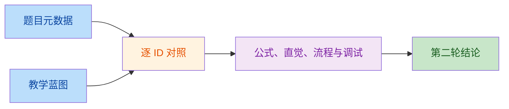
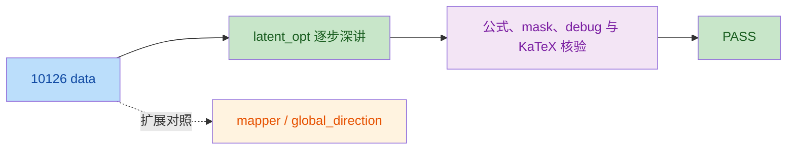

# 生成式 AI 教学质量审查（10111-10134）

## 审查口径

- `易读`：标题与原题主题一致；`易学`：直觉适合初学者；`易调试`：debugTip 能检查明确中间量；`公式`：语义正确且贴合主题；`步骤`：flow 连续、可观察并覆盖题目核心任务。
- 任一检查项为 `FAIL`，该 ID 的结论即为 `FAIL`。

## 逐项结论

| ID | 易读 | 易学 | 易调试 | 公式 | 步骤 | 结论 | 备注 |
|---:|:---:|:---:|:---:|:---:|:---:|:---:|---|
| 10111 | PASS | FAIL | PASS | PASS | PASS | FAIL | `epsilon_theta(x_t,t)` 对应从 `x_0` 直达 `x_t` 的累计噪声；直觉却称为“这一小步加入的噪声”，与公式冲突。 |
| 10112 | PASS | PASS | PASS | PASS | FAIL | FAIL | 不同 beta 训练调度绑定不同前向过程；直接“用同一模型”比较质量缺少逐调度训练/适配与同预算评估，实验链不成立。 |
| 10113 | PASS | PASS | PASS | PASS | FAIL | FAIL | flow 只执行 DDIM 更新，没有原题要求的 DPM++/Heun 等分支、统一 NFE 计时和质量对比，无法完成“采样器对比”。 |
| 10114 | PASS | PASS | PASS | PASS | FAIL | FAIL | flow 只算一次 CFG 更新，没有固定 seed 扫描 scale、生成结果、评价伪影/得分并选择工作点，未形成调参闭环。 |
| 10115 | PASS | PASS | PASS | PASS | FAIL | FAIL | flow 将文本注意力写成只在“中间层”注入，且未表示 U-Net 在 down/mid/up 多尺度使用交叉注意力及循环去噪后再解码。 |
| 10116 | PASS | PASS | PASS | PASS | PASS | PASS | 条件预处理、零卷积残差、主干注入和一致性评估连续；零初始化与 `strength=0` 均可核验。 |
| 10117 | PASS | PASS | PASS | PASS | PASS | PASS | 两个目标被明确区分；教师停梯度、成对预测距离和 SDS 梯度分量均可观察。 |
| 10118 | PASS | PASS | PASS | FAIL | PASS | FAIL | `B` 定义为批次图像数时，`B/T_batch` 的量纲是 images/s（吞吐），不是 queries/s；成本公式量纲正确。 |
| 10119 | PASS | PASS | PASS | PASS | PASS | PASS | 生成器放大与判别器压缩路径吻合原题，shape 和激活统计可逐层验证。 |
| 10120 | PASS | PASS | PASS | PASS | PASS | PASS | 批内平均特征距离定义正确，并与重复率、类别覆盖和判别器状态组成可观察诊断链。 |
| 10121 | PASS | PASS | PASS | PASS | PASS | PASS | critic 损失符号、插值点和输入梯度惩罚正确；梯度范数及两项损失可直接定位故障。 |
| 10122 | PASS | PASS | PASS | PASS | FAIL | FAIL | flow 先“逐层调制合成特征”再应用 truncation；`psi` 必须先变换注入各层的 `w`，当前顺序不是可执行链。 |
| 10123 | PASS | PASS | PASS | PASS | PASS | PASS | 双向翻译、循环重建、PatchGAN 与加权损失衔接完整，双向误差和 patch logit 可检查。 |
| 10124 | PASS | PASS | PASS | PASS | PASS | PASS | 真假样本对称经过同一可微增强策略，梯度回到生成器的路径明确且可验证。 |
| 10125 | PASS | PASS | PASS | PASS | PASS | PASS | 截断采样、条件生成、质量/覆盖评估和阈值扫描形成完整实验，接受率与潜变量方差可核验。 |
| 10126 | PASS | PASS | PASS | PASS | PASS | PASS | 反演、生成、联合损失、潜向量更新和局部合成顺序合理；mask 内外变化是明确检查量。 |
| 10127 | PASS | PASS | PASS | PASS | PASS | PASS | 重参数公式、`logvar` 到标准差的转换和反传路径一致，经验均值/方差可复核。 |
| 10128 | PASS | PASS | PASS | PASS | PASS | PASS | beta 加权 ELBO 与解耦/重构折中一致，逐维 KL、inactive units 和 traversal 均可观察。 |
| 10129 | PASS | PASS | PASS | PASS | FAIL | FAIL | flow 从 `q(z|x,c)` 采样，描述的是训练期重构；条件生成应在推理时从 `p(z|c)` 采样后直接解码，当前未覆盖原题生成管线。 |
| 10130 | PASS | PASS | PASS | PASS | FAIL | FAIL | flow 在解码和得到重构损失之前就“训练编码器、更新码本”；前向解码必须先于反传及参数/EMA 更新。 |
| 10131 | PASS | PASS | PASS | PASS | PASS | PASS | IWAE 下界与重要性权重正确，log-space 聚合及 `K=1` 对照给出明确数值检查。 |
| 10132 | PASS | PASS | PASS | PASS | PASS | PASS | 正常数据拟合、逐项异常评分、验证集定阈值和漂移监控连续，分数分布可校准。 |
| 10133 | PASS | PASS | PASS | PASS | PASS | PASS | 层级生成分解和逐层 KL 语义正确，自底向上推断与自顶向下生成路径可观察。 |
| 10134 | PASS | PASS | PASS | PASS | PASS | PASS | 观测编码、动作条件动力学、表示监督和真实转移校正连贯，预测误差与 rollout 发散点可检查。 |

## BLOCKERS

1. **10111**：把网络目标改述为 `x_t` 相对 `x_0` 的累计噪声，避免与闭式采样公式矛盾。
2. **10112**：按调度分别训练或明确兼容的适配方式，再在相同训练量/NFE 下比较；不能直接复用同一模型得出调度优劣。
3. **10113**：加入各采样器分支及统一 NFE、耗时、FID/CLIP score 的对比汇合步骤。
4. **10114**：补齐固定输入下的 scale 扫描、结果评价与最优值选择步骤。
5. **10115**：将交叉注意力放回实际的 down/mid/up 对应模块，并明确多步 U-Net 去噪完成后才由 VAE 解码。
6. **10118**：将 `B/T_batch` 命名为图像吞吐（images/s），或重新定义请求及 QPS 的计数单位。
7. **10122**：把 truncation 移到逐层风格注入和图像合成之前；风格混合与 truncation 也可拆成两条实验支路。
8. **10129**：分开训练重构链与推理生成链，后者应为 `c -> z ~ p(z|c) -> p_theta(x|z,c)`。
9. **10130**：调整为量化后先解码并计算损失，再反传编码器并以梯度或 EMA 更新码本。

## NON_BLOCKING

1. **符号完整性**：10121 补充 `epsilon ~ U(0,1)`；10134 展开 KL 的后验与先验参数。
2. **公式适用域**：10113 用“上一选定时刻”记号替代容易误解为相邻步的 `t-1`；10125 将 Precision 上升、Recall 下降标为通常趋势而非必然定律。
3. **实现细节**：10116 可把控制残差写成同时依赖 noisy latent、时间、文本和控制条件；10126 在 flow 中明确 mask 同时约束损失与最终合成。
4. **原题措辞**：10134 的 data 描述写“无模型强化学习”，但 Dreamer/RSSM 与预测动力学属于基于模型路线，建议统一口径。

## 第二轮复核（最终代码，2026-08-28）

复核对象为当前最终代码中的 `src/config/aiLessonBlueprints/{diffusion,gan,vae}.ts`、`src/dataai/{diffusion,gan,vae}.ts` 及通用 guided lesson 展示链路。判定维度为：正确性、公式/符号完整、初学者直觉、步骤可执行、调试建议、题目元数据一致；`WARN` 为不影响主线的精度问题。

| ID | 正确性 | 公式/符号 | 初学者直觉 | 步骤可执行 | 调试建议 | 元数据一致 | 结论 | 第二轮备注 |
|---:|:---:|:---:|:---:|:---:|:---:|:---:|:---:|---|
| 10111 | PASS | PASS | PASS | PASS | PASS | PASS | PASS | **原 FAIL 已修复**：直觉与符号均明确网络预测 `x_t` 相对 `x_0` 的累计噪声。 |
| 10112 | PASS | PASS | PASS | PASS | PASS | PASS | PASS | **原 FAIL 已修复**：按调度分别训练/适配，并统一训练量、NFE、seed 与样本。 |
| 10113 | PASS | PASS | PASS | PASS | PASS | PASS | PASS | **原 FAIL 已修复**：四类采样器分支、跳步记号 `s<t`、实际 NFE、耗时与质量对比完整。 |
| 10114 | PASS | PASS | PASS | PASS | PASS | PASS | PASS | **原 FAIL 已修复**：固定输入扫描 scale，完成整段采样、评价、选择和额外 seed 复核。 |
| 10115 | PASS | PASS | PASS | PASS | PASS | PASS | PASS | **原 FAIL 已修复**：down/mid/up 交叉注意力与多步去噪后单次 VAE 解码顺序明确。 |
| 10116 | PASS | PASS | PASS | PASS | PASS | PASS | PASS | 控制残差显式依赖 noisy latent、时刻、文本和控制条件，`strength=0` 可对照。 |
| 10117 | PASS | PASS | PASS | PASS | PASS | PASS | PASS | Consistency 与 SDS 目标、停梯度边界及各自更新对象区分清楚。 |
| 10118 | PASS | PASS | PASS | PASS | PASS | PASS | PASS | **原 FAIL 已修复**：公式与 data 均统一为图像吞吐 `images/s`，成本量纲正确。 |
| 10119 | PASS | PASS | PASS | PASS | PASS | PASS | PASS | DCGAN 双向结构、尺寸变化、激活统计与交替更新连贯。 |
| 10120 | PASS | PASS | PASS | PASS | PASS | PASS | PASS | 批内两两距离、类别覆盖和时间对齐诊断可共同识别模式崩溃。 |
| 10121 | PASS | PASS | PASS | PASS | PASS | PASS | PASS | 插值分布 `epsilon~U(0,1)`、critic 符号与输入梯度惩罚完整。 |
| 10122 | PASS | PASS | PASS | PASS | PASS | PASS | PASS | **原 FAIL 已修复**：风格混合与 truncation 分支拆开，截断先于逐层注入和合成。 |
| 10123 | PASS | PASS | PASS | PASS | PASS | PASS | PASS | 双向循环、PatchGAN、身份损失和联合更新构成闭环。 |
| 10124 | PASS | PASS | PASS | PASS | PASS | PASS | PASS | 真假样本对称经过可微增强，生成器梯度路径可验证。 |
| 10125 | PASS | PASS | PASS | PASS | PASS | PASS | PASS | 截断的质量/多样性变化已限定为经验趋势，并要求实测扫描。 |
| 10126 | PASS | PASS | PASS | PASS | PASS | PASS | PASS | data 已移除跨领域的 Null-Text，改为 StyleCLIP 的 latent optimization、mapper 与 global direction；蓝图给出共同的潜空间优化主链。 |
| 10127 | PASS | PASS | PASS | PASS | PASS | PASS | PASS | 后验参数、`logvar -> sigma`、独立噪声和经验矩检查完整。 |
| 10128 | PASS | PASS | PASS | PASS | PASS | WARN | PASS | 重构损失方向已澄清且限定为经验趋势；学习目标仍把模型名 `FactorVAE` 与指标 `MIG` 并列称为“解耦指标”。 |
| 10129 | PASS | PASS | PASS | PASS | PASS | PASS | PASS | **原 FAIL 已修复**：训练后验重构与推理条件先验生成已拆成两条链。 |
| 10130 | PASS | PASS | PASS | PASS | PASS | PASS | PASS | **原 FAIL 已修复**：量化后先解码、计算三项损失，再反传并更新码本。 |
| 10131 | PASS | PASS | PASS | PASS | PASS | PASS | PASS | IWAE 下界、权重、logsumexp 和 `K=1` 基线检查完整。 |
| 10132 | PASS | PASS | PASS | PASS | PASS | PASS | PASS | 正常数据拟合、评分、验证阈值、告警与漂移监控连续。 |
| 10133 | PASS | PASS | PASS | PASS | PASS | PASS | PASS | data 已改为输出各层 KL、占比与消融结果，不再把逐层递减当作架构保证。 |
| 10134 | PASS | PASS | PASS | PASS | PASS | PASS | PASS | 后验/先验参数已展开，data 已统一为基于模型强化学习。 |

### 复核结论

- 原有 FAIL `10111、10112、10113、10114、10115、10118、10122、10129、10130` 均已修复。
- 24/24 题无阻断；10128 仅有一个非阻断的指标命名问题。
- KaTeX 独立校验：24 个公式、113 个符号以 `throwOnError` 渲染，全部通过。
- 全量 `npm test` 18/18 通过；`npm run lint` 与 `npx tsc --noEmit` 通过。

### BLOCKERS

**BLOCKERS: 无**

### NON_BLOCKING

1. **10128**：将“FactorVAE / MIG 等解耦指标”改为“FactorVAE Score / MIG 等解耦指标”，或把 FactorVAE 单列为对照模型。

## 第三轮复核（当前工作树，2026-08-28）

| ID | 结论 | 第三轮核验 |
|---:|:---:|---|
| 10126 | PASS | `Null-Text` 已移除；`latent_opt`、mapper、global direction 被正确表述为 StyleCLIP 编辑策略，原图反演则是先得到 `w_0` 的独立前置步骤。公式、mask 约束与最终合成对 latent optimization 路径成立。 |
| 10128 | PASS | `FactorVAE Score` 与 `MIG` 均为解耦评估指标，命名已修正；`reconstruction_loss` 变大表示重构变差，且代码已把随 beta 变化的方向限定为经验趋势。第二轮命名问题已关闭。 |
| 10133 | PASS | 联合分布分解与逐层 KL 的 ELBO 写法成立：顶层对标准先验、其余层对条件先验；代码也已明确各层 KL 不保证单调递减。 |

- **BLOCKERS：无。**
- **NON_BLOCKING：10126** 的 guided 公式/flow 只展开 latent optimization；若课程要让 `edit_strategy` 的 mapper 与 global direction 也可独立学习，仍应分别补充其推理路径。
- **NON_BLOCKING：10128** 虽已修正指标名称，但 outputs 和 guided 内容仅实际使用 MIG/DCI；若保留“掌握 FactorVAE Score”的学习目标，应补其计算/输出，否则应收窄目标。
- **NON_BLOCKING：10133** 的 `D_KL^(ell)` 释义把所有层都称为“条件先验”；顶层实际对应无条件 `p(z_L)`，宜改为“相应先验（顶层标准先验，其余层条件先验）”。
- 验证：目标 5 个公式及 24 个符号均通过 KaTeX；`tests/fullCourseBlueprints.test.ts` 与 `tests/katexSources.test.ts` 合计 6/6 通过。

## 第四轮 10126 范围复核（当前工作树，2026-08-28）

- **结论：PASS。** `learningGoals` 与 `inputs` 均明确本课只逐步实现 latent optimization；mapper 与 global direction 仅为可进一步选择的扩展对照，不再暗示三条路线都已展开。
- 公式与 flow 均只描述 latent optimization；`M=1` 为编辑区、`M=0` 为保留区，区域外保持项和最终 mask 合成方向一致。debug 覆盖 CLIP cosine、identity loss、潜向量位移及 mask 内外像素差。
- KaTeX 严格渲染通过目标公式及 6 个符号；`tests/fullCourseBlueprints.test.ts` 与 `tests/katexSources.test.ts` 合计 7/7 通过。
- **BLOCKERS：0。**
