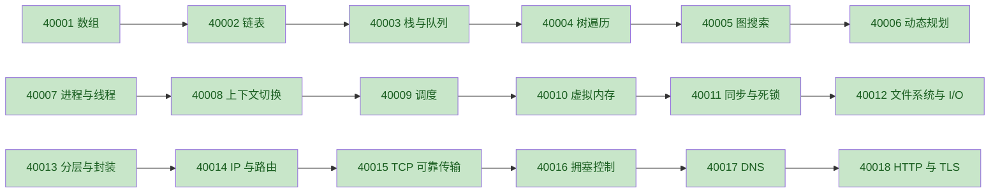

# 计算机基础概念教学质量审查（40001-40018）

## 审查口径

- `易读`：标题与主题一致；`易学`：直觉适合初学者；`易调试`：debugTip 能检查明确中间量；`公式`：语义正确且贴合主题；`步骤`：flow 连续且可观察。
- 当前 `src/dataconcepts/index.ts` 直接从蓝图映射题目字段，并无第二份独立题目正文；因此主题一致性以各条 `title` 对照 `description`、`keyPoints`、`tags` 及对应书籍主题审查。

## 逐项结论

| ID | 易读 | 易学 | 易调试 | 公式 | 步骤 | 结论 | 备注 |
|---:|:---:|:---:|:---:|:---:|:---:|:---:|---|
| 40001 | PASS | PASS | PASS | PASS | PASS | PASS | 地址换算到顺序扫描衔接自然；地址差与缓存未命中均可核验。 |
| 40002 | PASS | PASS | PASS | PASS | PASS | PASS | 已明确 O(1) 插入以已知前驱为前提；遍历与改链可逐步观察。 |
| 40003 | PASS | PASS | PASS | PASS | PASS | PASS | LIFO/FIFO 对照直接，固定输入可验证容器端点和输出次序。 |
| 40004 | PASS | PASS | PASS | PASS | PASS | PASS | 已明确聚焦中序递归 DFS；进入、左子树、visit、右子树、exit 的顺序确定，配合事件与递归栈可逐帧核验。 |
| 40005 | PASS | PASS | PASS | PASS | PASS | PASS | 前沿与 visited 构成完整可观测循环；复杂度应理解为邻接表下的完整搜索。 |
| 40006 | PASS | PASS | PASS | PASS | PASS | PASS | 状态、基础状态、转移、依赖顺序完整；公式是最小成本型 DP 的有效示例。 |
| 40007 | PASS | PASS | PASS | PASS | PASS | PASS | 资源容器与独立执行现场区分清楚；ID、共享地址和栈地址可核验。 |
| 40008 | PASS | PASS | PASS | PASS | PASS | PASS | 触发、保存、选择、恢复连续；现场值与时间戳是明确中间量。 |
| 40009 | PASS | PASS | PASS | PASS | PASS | PASS | 单 CPU burst 教学模型下周转/等待公式正确，甘特区间可复算。 |
| 40010 | PASS | PASS | PASS | PASS | PASS | PASS | 页号、偏移、页框映射一致，且偏移不变量可直接检查。 |
| 40011 | PASS | PASS | PASS | PASS | PASS | PASS | 互斥不变量与单实例资源等待图成环条件均已正确限定。 |
| 40012 | PASS | PASS | PASS | PASS | PASS | PASS | 偏移拆块到缓存/设备 I/O 连续，分段长度和块映射可检查。 |
| 40013 | PASS | PASS | PASS | PASS | PASS | PASS | 发送端逐层封装顺序明确，协议字段和各层长度可抓包观察。 |
| 40014 | PASS | PASS | PASS | PASS | PASS | PASS | 最长前缀匹配语义正确，掩码结果、前缀长度、下一跳均可核验。 |
| 40015 | PASS | PASS | PASS | PASS | PASS | PASS | 已将累计 ACK 定义为 `RCV.NXT`，即首个尚未按序收到的字节；区间图与缺口推进法可执行并覆盖乱序缓存。 |
| 40016 | PASS | PASS | PASS | PASS | PASS | PASS | 公式可作为 AIMD/Reno 拥塞避免简化模型，窗口、在途量与丢包点可观测。 |
| 40017 | PASS | PASS | PASS | PASS | PASS | PASS | 委派查询与缓存链路连贯，TTL 递减和到期时刻是明确中间量。 |
| 40018 | PASS | PASS | PASS | PASS | PASS | PASS | 冷启动 HTTPS 路径与延迟分解一致，分阶段计时和证书字段可检查。 |

## 入门路径

三条路径的依赖关系总体合理：数据结构由线性结构推进到树、图和 DP；操作系统由执行实体推进到调度、内存、同步和 I/O；网络由分层推进到网络层、传输层和应用层。网络路径的难度从两个 `hard` 回落到两个 `medium`，不影响依赖正确性，但学习梯度不够平滑。

## BLOCKERS

无。

## NON_BLOCKING

1. **公式适用域**：40005 补充“邻接表/已覆盖子图”，40006 标注“最小成本型示例”，40009 标注“无阻塞的单 CPU burst”，40016 标注“AIMD/Reno 简化模型”。
2. **符号表完整性**：补充 40007 的 `R_i`、40008 的 `T_restore`、40009 的 `T_run`、40010 的 `frame[p]`。
3. **路径梯度**：操作系统可先讲调度目标再讲切换机制；网络可把 `medium` 的 DNS/HTTP 前移或维持现顺序但解释为何先完成 TCP 深入内容。

---

## 第二轮复核（最终代码，2026-08-28）

### 复核口径与数据链路

- 逐项重读 `dataStructuresAlgorithms.ts`、`operatingSystems.ts`、`networks.ts`，并核对共享教学步骤、概念详情页和书架页的实际消费方式。
- `PASS` 表示知识、公式与教学链路可直接发布；`WARN` 仅表示可提升的解释精度，不构成知识错误或课程阻断。
- `src/dataconcepts/index.ts` 直接由 `conceptLessonBlueprints` 生成 `id`、`slug`、`bookId`、`category`、`difficulty`、正文和 flow 示例，不存在第二份内容源。40001-40018 的数据顺序也就是列表及上一节/下一节顺序。

### 逐 ID 第二轮结论

| ID | 知识正确性 | 公式/符号 | 初学者直觉 | 步骤可执行 | 调试建议 | 顺序/data | 二轮结论与证据 |
|---:|:---:|:---:|:---:|:---:|:---:|:---:|---|
| 40001 | PASS | PASS | PASS | PASS | PASS | PASS | 连续地址、直接寻址和缓存局部性一致；地址差及缓存未命中均可实测。 |
| 40002 | PASS | PASS | PASS | PASS | PASS | PASS | 已把常数时间插入限定为已知前驱；遍历、改链、查环形成完整检查链。 |
| 40003 | PASS | PASS | PASS | PASS | PASS | PASS | LIFO/FIFO 的定义、固定输入和端点状态相互印证。 |
| 40004 | PASS | PASS | PASS | PASS | PASS | PASS | 明确本次推演为递归中序 DFS；enter/visit/exit 与递归栈可逐帧核验。 |
| 40005 | PASS | WARN | PASS | PASS | PASS | PASS | `Theta(|V|+|E|)` 对邻接表下完整覆盖的搜索成立；建议显式写成可达子图或全图遍历口径。 |
| 40006 | PASS | WARN | PASS | PASS | PASS | PASS | 方程是正确的最小成本型 DP 示例；建议说明它是 DP 的一种转移形态，并补 `dp[s]` 的符号释义。 |
| 40007 | PASS | WARN | PASS | PASS | PASS | PASS | 进程资源与线程现场区分正确；公式中的 `T_i`、`R_i` 尚未在符号表单列。 |
| 40008 | PASS | WARN | PASS | PASS | PASS | PASS | 保存、调度、恢复和间接成本完整；符号表遗漏 `T_restore`。 |
| 40009 | PASS | WARN | PASS | PASS | PASS | PASS | 周转公式正确；等待公式需保持“单 CPU burst、无阻塞时间”口径，且符号表遗漏 `T_run`。 |
| 40010 | PASS | WARN | PASS | PASS | PASS | PASS | 页号替换、偏移不变均正确；符号表遗漏 `frame[p]`，本节也未展开无效页分支。 |
| 40011 | PASS | PASS | PASS | PASS | PASS | PASS | 互斥不变量正确，等待图成环的充要条件已明确限定为单实例资源。 |
| 40012 | PASS | PASS | PASS | PASS | PASS | PASS | 文件偏移拆块、缓存查询和设备 I/O 顺序连续，跨块长度可复算。 |
| 40013 | PASS | PASS | PASS | PASS | PASS | PASS | 封装公式与发送端逐层加头一致，抓包长度和协议字段均可观察。 |
| 40014 | PASS | PASS | PASS | PASS | PASS | PASS | 最长前缀匹配、TTL 递减和下一跳选择语义正确且可核验。 |
| 40015 | PASS | PASS | PASS | PASS | PASS | PASS | `ACK=RCV.NXT` 指向首个缺口；区间法可处理乱序到达而不误推进 ACK。 |
| 40016 | PASS | WARN | PASS | PASS | PASS | PASS | 增加式是拥塞避免中的 AIMD/Reno 简化模型；减半不是所有 TCP/所有丢包路径的通式，建议继续显式限定适用域。 |
| 40017 | PASS | PASS | PASS | PASS | PASS | PASS | 委派、递归缓存与 TTL 到期链路正确，连续查询可直接观察 TTL 递减。 |
| 40018 | PASS | PASS | PASS | PASS | PASS | PASS | 冷启动 HTTPS 的阶段分解与流程一致，分阶段计时和证书字段可检查。 |

### 课程顺序与元数据

- 数据结构与算法：40001 -> 40002 -> 40003 -> 40004 -> 40005 -> 40006，由线性结构进入树、图和 DP，依赖合理。
- 操作系统：40007 -> 40008 -> 40009 -> 40010 -> 40011 -> 40012；机制顺序可用，虽有 `hard -> medium` 的难度回落，但不破坏先修关系。
- 网络：40013 -> 40014 -> 40015 -> 40016 -> 40017 -> 40018；先完成传输主线再进入 DNS/HTTPS，主题依赖正确，难度并非单调递增。
- 三本书均为 6 题；ID、slug 唯一，`bookId`、category、difficulty、标题和规范清单一致。

### 原结论复核

本报告首轮没有 FAIL。第二轮逐项重读后未发现需要改判的知识错误；上表 7 个 `WARN` 均为适用域或符号表精度，不影响核心推演成立。

### 验证记录

- 概念契约与 KaTeX 专项：`node --experimental-strip-types --test tests/fullCourseBlueprints.test.ts tests/katexSources.test.ts`，6/6 通过。
- 概念蓝图严格 KaTeX：36 个公式及全部符号共 191 次 `throwOnError` 渲染，全部通过。
- `npx tsc --noEmit`：通过；`npm run lint`：通过。
- 全量 `npm test`：18/18 通过。

**BLOCKERS: 无**

### 第二轮非阻断建议

1. 为 40007、40008、40009、40010 补齐 `T_i/R_i`、`T_restore`、`T_run`、`frame[p]` 的符号解释。
2. 为 40005、40006、40009、40016 在公式附近保留适用域提示，避免初学者把示例公式推广为无条件通式。
