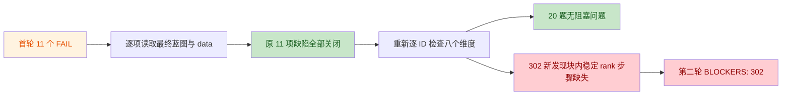

# CUDA 教学蓝图逐 ID 审查

范围：`src/config/cudaLessonBlueprints` 七个内容分片，对照 `src/datacuda` 七个对应原题分片，共 21 个缺失 ID。`易读/易学/易调试/公式/步骤` 分别对应标题与主题、初学者直觉、可检查的中间量、公式语义、连续且符合 CUDA 执行边界的 flow。

| ID | 易读 | 易学 | 易调试 | 公式 | 步骤 | 结论 | 备注 |
|---:|:---:|:---:|:---:|:---:|:---:|:---:|---|
| 102 | PASS | PASS | PASS | PASS | PASS | 通过 | 与 `ax+b` 原题一致；线程、全局内存、无需同步和输出均明确。 |
| 103 | PASS | PASS | PASS | PASS | PASS | 通过 | ReLU/LeakyReLU 的分支、公式和逐元素路径一致。 |
| 104 | PASS | PASS | PASS | PASS | PASS | 通过（NON_BLOCKING） | 核心内容正确；调试断言偏向 Sigmoid，未给 Tanh 的明确期望值。 |
| 105 | PASS | PASS | PASS | PASS | PASS | 通过 | 转换、向量化读写、对齐和误差检查形成闭环。 |
| 106 | PASS | PASS | PASS | FAIL | PASS | BLOCKER | 蓝图采用 inverted dropout；原题 `p=0.5` 示例却让保留值仍为 1，二者输出相差 `1/(1-p)`。 |
| 201 | PASS | PASS | PASS | PASS | FAIL | BLOCKER | 局部和写入 shared memory 后，在第一次读取合并前缺少明确的块内屏障。 |
| 202 | PASS | PASS | PASS | PASS | FAIL | BLOCKER | flow 从 block 极值直接跳到最终极值，缺少跨 block 的第二次归约、原子方案或 grid 同步边界。 |
| 203 | PASS | PASS | PASS | PASS | FAIL | BLOCKER | block 部分平方和与“最终线程开方”之间缺少全局合并及 kernel 边界；flow 也未落实所宣称的缩放稳定化。 |
| 301 | PASS | PASS | PASS | PASS | FAIL | BLOCKER | 连续元素载入 shared memory 后，首轮读取邻居前未明确块内同步；后续跨 block 三阶段是完整的。 |
| 302 | PASS | PASS | PASS | PASS | FAIL | BLOCKER | block 内计数和块内同步不能直接产生全局稳定 scatter 偏移；缺少 block 直方图写出、全局 scan 与 kernel/grid 边界。 |
| 303 | PASS | PASS | PASS | PASS | FAIL | BLOCKER | shared 桶被正确清零，但全局直方图在 `atomicAdd` 合并前既未清零，也未声明必须预清零。 |
| 401 | PASS | PASS | PASS | PASS | PASS | 通过（NON_BLOCKING） | tiled SGEMM 主线正确；原题列出的 Double Buffering 学习目标未体现。 |
| 402 | PASS | PASS | PASS | PASS | FAIL | BLOCKER | “一个 warp 或 block 负责一行”之后只有 warp shuffle；多 warp block 缺少 shared partial、块内屏障和跨 warp 合并。 |
| 403 | PASS | PASS | PASS | PASS | FAIL | BLOCKER | 只写出首次 tile 装载后的同步，未展示 K 方向重复装载以及覆盖 shared tile 前的屏障。 |
| 501 | PASS | PASS | PASS | PASS | PASS | 通过（NON_BLOCKING） | direct-convolution flow 可成立，但公式默认 stride=1、无 padding；原题的 Im2Col/Implicit GEMM 目标未覆盖。 |
| 502 | PASS | PASS | PASS | PASS | PASS | 通过 | 一线程一窗口、无需块同步、边界检查和输出均清楚。 |
| 503 | PASS | PASS | PASS | PASS | FAIL | BLOCKER | 两遍可分离卷积缺少横向结果写入全局临时缓冲，以及纵向 kernel 重新读取 tile/halo 的步骤。 |
| 601 | PASS | PASS | PASS | PASS | PASS | 通过 | shared tile、padding、块内同步、坐标交换和合并写回连续完整。 |
| 602 | PASS | PASS | FAIL | FAIL | FAIL | BLOCKER | 重复 Scatter 索引下赋值公式无确定语义；“原子操作或唯一索引”未选定覆盖/归约/拒绝策略，调试也没有可判定的预期输出。 |
| 701 | PASS | PASS | PASS | PASS | PASS | 通过（NON_BLOCKING） | 标准带仿射 LayerNorm 正确；原题 inputs 未列 `gamma/beta`，且其“输出均值 0、方差 1”只对仿射前结果成立。 |
| 702 | PASS | PASS | PASS | PASS | PASS | 通过 | Max、Exp、Sum、Div 的两次归约、同步和输出闭环完整。 |

## BLOCKERS

1. **106**：统一 Dropout 语义；若保留 inverted dropout，原题示例的非零项在 `p=0.5` 时应为 2，并应在调试项核对缩放输出。
2. **201**：在 shared memory 初始写入与第一次归约读取之间补 `__syncthreads()` 边界。
3. **202**：补 block 部分极值到全局最终极值的明确跨 block 合并阶段。
4. **203**：补部分平方和的全局归约/kernel 边界，再由最终结果开方；同时让稳定化策略在 flow 中可观察。
5. **301**：补 shared memory 初始装载后的同步，再进入距离 1 的扫描轮次。
6. **302**：补每个 block 的计数/局部 rank、全局偏移 scan、稳定 scatter 之间的 kernel 或 grid 同步边界。
7. **303**：在全局原子合并前增加输出桶清零步骤，或明确它是调用前置条件。
8. **402**：限定为“一 warp 一行”，或补多 warp block 的 shared-memory 二级归约与同步。
9. **403**：补 K-tile 循环及每次 shared tile 被覆盖前的块内屏障。
10. **503**：明确横向 kernel 写全局临时缓冲、kernel 边界、纵向 kernel 重新加载并同步后输出。
11. **602**：先规定重复索引语义，再使公式、原子操作和 debugTip 使用同一可判定策略。

## NON_BLOCKING

- **104**：补 `Tanh(0)=0`、输出范围 `[-1,1]` 等独立检查，避免 `[0,1]` 断言被误用于 Tanh。
- **401**：若需完整兑现原题学习目标，增加 Double Buffering 的装载/计算重叠说明。
- **501**：声明公式的 stride/padding 假设；若原题目标是规范，另补 Im2Col/Implicit GEMM 路径。
- **701**：在原题 inputs/示例中补 `gamma/beta`，或注明均值 0、方差 1 指仿射前的标准化值。

## 结论

**不通过。** 21 个 ID 均已逐项审查，其中 11 个存在 BLOCKER；修复后应再次逐 ID 复审。

## 第二轮复核

复核基线：2026-08-28 12:55（Asia/Shanghai）工作区最终快照。重新读取了 7 个 CUDA 蓝图分片、7 个 `src/datacuda` 原题分片、蓝图类型/步骤生成器、CUDA 路由注册与相关测试。以下判定覆盖算法正确性、thread/warp/block/grid/kernel 同步边界、global/shared/constant/register 内存语义、公式与符号、初学者可读性、步骤可执行性、调试建议及 `data` 元数据一致性。

判定说明：`PASS` 表示本轮未发现实质问题；`NB` 表示不影响当前主算法正确性的改进项；`FAIL` 表示会使初学者无法按步骤得到被公式保证的结果。

| ID | 算法 | 同步边界 | 内存语义 | 公式符号 | 易读 | 步骤 | 调试 | data | 第二轮结论 |
|---:|:---:|:---:|:---:|:---:|:---:|:---:|:---:|:---:|:---:|
| 102 | PASS | PASS | PASS | PASS | PASS | PASS | PASS | PASS | 通过 |
| 103 | PASS | PASS | PASS | PASS | PASS | PASS | PASS | NB | 通过（NON_BLOCKING） |
| 104 | PASS | PASS | PASS | PASS | PASS | PASS | PASS | PASS | 通过 |
| 105 | PASS | PASS | PASS | PASS | PASS | NB | PASS | PASS | 通过（NON_BLOCKING） |
| 106 | PASS | PASS | PASS | PASS | PASS | PASS | PASS | PASS | 通过；原 FAIL 已关闭 |
| 201 | PASS | PASS | PASS | PASS | PASS | PASS | PASS | NB | 通过（NON_BLOCKING）；原 FAIL 已关闭 |
| 202 | PASS | PASS | PASS | PASS | PASS | PASS | NB | PASS | 通过（NON_BLOCKING）；原 FAIL 已关闭 |
| 203 | PASS | PASS | PASS | PASS | PASS | PASS | PASS | PASS | 通过；原 FAIL 已关闭 |
| 301 | PASS | PASS | PASS | PASS | PASS | NB | PASS | NB | 通过（NON_BLOCKING）；原 FAIL 已关闭 |
| 302 | PASS | FAIL | PASS | PASS | PASS | FAIL | PASS | PASS | **BLOCKER**；原 FAIL 已关闭，但发现新的块内 rank 缺口 |
| 303 | PASS | PASS | PASS | PASS | PASS | PASS | PASS | PASS | 通过；原 FAIL 已关闭 |
| 401 | PASS | PASS | PASS | PASS | PASS | PASS | PASS | PASS | 通过；原 NON_BLOCKING 已关闭 |
| 402 | PASS | PASS | PASS | PASS | PASS | PASS | PASS | PASS | 通过；原 FAIL 已关闭 |
| 403 | PASS | PASS | PASS | PASS | PASS | PASS | PASS | PASS | 通过；原 FAIL 已关闭 |
| 501 | PASS | PASS | PASS | PASS | PASS | PASS | PASS | PASS | 通过；原 NON_BLOCKING 已关闭 |
| 502 | PASS | PASS | PASS | PASS | PASS | PASS | PASS | NB | 通过（NON_BLOCKING） |
| 503 | PASS | PASS | PASS | PASS | PASS | PASS | PASS | PASS | 通过；原 FAIL 已关闭 |
| 601 | PASS | PASS | PASS | PASS | PASS | NB | PASS | PASS | 通过（NON_BLOCKING） |
| 602 | PASS | PASS | PASS | PASS | PASS | PASS | PASS | PASS | 通过；原 FAIL 已关闭 |
| 701 | PASS | PASS | PASS | PASS | PASS | PASS | PASS | PASS | 通过；原 NON_BLOCKING 已关闭 |
| 702 | PASS | PASS | PASS | PASS | PASS | PASS | PASS | PASS | 通过 |

### 复核路径

### 原报告 FAIL 逐项复核

| 原 FAIL | 第二轮状态 | 最终代码证据 |
|---:|:---:|---|
| 106 | 已关闭 | 统一为 inverted dropout；公式、输出元数据和 `p=0.5` 示例均把保留项缩放为 2。 |
| 201 | 已关闭 | shared 初始写入后先做全 block `__syncthreads()`；每轮归约后再次同步，并以递归 kernel 形成 grid 边界。 |
| 202 | 已关闭 | 明确 warp 到 block 的二级归约、全局部分量数组、kernel 结束边界及递归归约。 |
| 203 | 已关闭 | 明确先归约全局尺度 `s`，再归约缩放平方和 `q`，最后在独立 kernel 计算 `s*sqrt(q)`。 |
| 301 | 已关闭 | shared 初始装载后增加同步，并补齐块总和 scan 与偏移回填的 kernel 边界。 |
| 302 | 原问题已关闭 | `blockHist -> 全局 scan -> O/B -> scatter` 的跨 block 链路已闭合；本轮 BLOCKER 是不同问题，见下节。 |
| 303 | 已关闭 | 同一 stream 先清零全局桶，再启动统计 kernel；shared 桶初始化、统计和全局合并边界完整。 |
| 402 | 已关闭 | 明确限定“一 warp 一行”，lane 0 唯一写回；多 warp 合作一行被明确列为另一种需要二级归约的方案。 |
| 403 | 已关闭 | K-tile 循环包含装载后和覆盖前两次全 block 屏障，随后才执行融合 epilogue。 |
| 503 | 已关闭 | 横向结果写入独立全局缓冲 `H`，以 kernel 结束作为全局可见性边界，再由纵向 kernel 重载；边缘统一为 clamp-to-edge。 |
| 602 | 已关闭 | 语义固定为整型 ScatterAdd；目标先清零、重复索引用 `atomicAdd` 求和、kernel 结束后再读取。 |

首轮 4 个 NON_BLOCKING 也已处理：104 增加 Tanh 独立断言；401 展开 ping/pong Double Buffering；501 补齐 stride/padding 与 Im2Col/Implicit GEMM；701 的 `gamma/beta/epsilon`、仿射输出和统计量口径已在 `data` 中对齐。

### BLOCKERS

1. **302：块内稳定 rank 的计算和同步步骤缺失。** 当前 flow 从“提取 `d_i`”直接跳到“每个线程写出 `rho_i`”，没有说明如何对 0/1 标志执行块内 exclusive scan，也没有给出该 scan 各轮所需的 block 同步。`rho_i` 是稳定 scatter 地址的一部分；若初学者改用原子递增取得局部序号，虽然位置可能唯一，却不保证保持原输入顺序，LSD radix sort 因而不再正确。应在写出 `rho_i` 前补上 shared-memory 标志构造、块内 exclusive scan、每轮同步以及由 scan 末值产生 0/1 `blockHist` 的步骤。证据：[scanSort.ts:41](../../src/config/cudaLessonBlueprints/scanSort.ts#L41)。

**BLOCKERS: 302（1 项）。**

### NON_BLOCKING

- **103 / data**：蓝图覆盖 LeakyReLU 和 `alpha`，但原题 inputs 只有 `X`、outputs/example 只描述 ReLU；建议补 `alpha` 及 LeakyReLU 示例。
- **105 / 步骤**：向量化读写未明确 `N` 不是向量宽度整数倍时的 masked/scalar tail；建议把尾部路径加入 flow 或 debugTip。
- **201 / data**：原题 `visualizationFocus` 包含 Warp Shuffle 和 Bank Conflict，蓝图主流程只明确 shared-memory 树归约；建议补 warp 尾归约及无冲突索引，或收窄元数据承诺。
- **202 / 调试**：takeaway 要求明确 NaN 比较规则，但当前仅测试有限负数；建议声明忽略、传播或拒绝 NaN 的固定策略。
- **301 / 步骤与 data**：距离应写成 `1,2,4,...` 直到覆盖 block；当前蓝图实质只展开双缓冲 Hillis-Steele，而原题同时承诺 Blelloch，建议二选一对齐或补充对照。
- **502 / data**：公式与调试依赖窗口 `R x S` 和 stride `(u,v)`，原题 inputs 尚未列这两个参数，也未声明当前公式采用无 padding 的 valid pooling。
- **601 / 步骤**：debugTip 使用非方阵验证边缘 tile，但 flow 未显式写出 partial tile 的条件加载和条件写回；建议补充，避免照步骤实现时越界。

### 测试与校验

- `node --experimental-strip-types --test tests/fullCourseBlueprints.test.ts tests/katexSources.test.ts tests/visualizationCoverage.test.ts`：**8/8 通过**；覆盖 21 个 CUDA ID、蓝图完整性、全部静态公式/符号 KaTeX 严格渲染以及 CUDA data/visualizer ID 一致性。
- `npx tsc --noEmit`：**通过**。
- `git diff --check`：**通过**。
- `npm test`：最近一次全量运行 **16/17 通过、1 个测试文件失败**；失败来自 `tests/progressIds.test.ts` 导入了尚未导出的 `getScopedProgressStats`，与 CUDA 蓝图内容和本报告无关。上述 CUDA/KaTeX 定向测试随后单独重跑并全部通过。
- 当前仓库没有可编译的 CUDA kernel；因此本轮能验证教学算法、同步/内存边界描述与前端数据契约，但不能用 `nvcc`、Compute Sanitizer 或 GPU 数值测试验证真实 kernel 行为。

### 第二轮结论

**不通过。** 首轮 11 个 FAIL 的原始问题均已修复，但 ID 302 新暴露的块内稳定 rank 生成步骤仍不完整；修复并复测后可清零 BLOCKERS。

## 第三轮验证

- **原 302 BLOCKER 已关闭**：当前 flow 已明确 shared `isZero_i/isOne_i`、全 block 同步、双缓冲 exclusive scan（逐轮同步并交换缓冲），并由末 scan 值与末标志生成 `blockHist`；随后按 block 扫描得到 `O_{b,d}` 与 `B_d`，局部 rank 构造及直方图/前缀交接本身可执行。证据：[scanSort.ts:42](../../src/config/cudaLessonBlueprints/scanSort.ts#L42)。
- **新 302 BLOCKER**：`rho_i` 在计数/rank kernel 内取得后，该 kernel 随即结束；后续 scatter kernel 直接使用 `rho_i`，但 flow 未说明把 rank 写入全局缓冲，也未在 scatter 中重新计算。register/shared 状态不能跨 kernel 保留，因此稳定 scatter 仍不能按当前步骤执行。证据：[scanSort.ts:44](../../src/config/cudaLessonBlueprints/scanSort.ts#L44)、[scanSort.ts:47](../../src/config/cudaLessonBlueprints/scanSort.ts#L47)。
- 校验：CUDA 蓝图/KaTeX/覆盖专项 **8/8 通过**；302 公式与符号严格 KaTeX **9/9 通过**；rank/histogram/offset/scatter 参考模型 **1600/1600 通过**；`npx tsc --noEmit` 与 `git diff --check` 通过。仓库无可编译 CUDA kernel，以上测试不能替代真实 kernel 生命周期验证。

**当前 BLOCKERS: 1（302）。**

## 第四轮最终复核

复核范围仅限当前工作树中的 ID 302 Radix Sort 及第三轮遗留项；未发现新的阻塞问题。

- **同步与稳定性闭环**：shared 标志写入后有全 block 屏障；双缓冲 exclusive scan 每轮只读当前缓冲、写备用缓冲并在交换前同步。线程按输入顺序从对应数字的 scan 结果取得 `rho_i`，没有使用竞争式原子编号。证据：[scanSort.ts:43](../../src/config/cudaLessonBlueprints/scanSort.ts#L43)、[scanSort.ts:50](../../src/config/cudaLessonBlueprints/scanSort.ts#L50)。
- **跨 kernel 生命周期闭环**：计数/rank kernel 将 `rho_i` 写入全局 `localRank[i]`；在计数与 scan 的 kernel 边界后，scatter kernel 明确重读该缓冲，再以 `B_d+O_{b,d}+rho_i` 生成唯一稳定位置。第三轮遗留 BLOCKER 已关闭。证据：[scanSort.ts:44](../../src/config/cudaLessonBlueprints/scanSort.ts#L44)、[scanSort.ts:47](../../src/config/cudaLessonBlueprints/scanSort.ts#L47)。
- **初学者可执行性与调试可观察性**：输入域、逐阶段产物、kernel 边界和 ping-pong 缓冲顺序完整；调试清单覆盖每轮 scan 缓冲、global `localRank`、`blockHist`、`O`、`pos`、重复 key 原序号与位置唯一性。证据：[scanSort.ts:42](../../src/config/cudaLessonBlueprints/scanSort.ts#L42)、[scanSort.ts:51](../../src/config/cudaLessonBlueprints/scanSort.ts#L51)。
- **KaTeX**：302 的主公式与 8 个符号均通过 `throwOnError: true` 的严格渲染检查；公式、符号解释及逐流程步骤也通过完整性断言。
- **最小相关测试**：`node --experimental-strip-types --test --test-name-pattern='all 21 missing CUDA|CUDA radix sort' tests/fullCourseBlueprints.test.ts`，**2/2 通过**。其中专项断言覆盖 exclusive scan、global `localRank[i]` 写入、scatter 重读及“状态不能跨 kernel”误区。证据：[fullCourseBlueprints.test.ts:116](../../tests/fullCourseBlueprints.test.ts#L116)。

仓库仍无可编译 CUDA kernel；本轮结论针对教学蓝图、前端步骤与静态公式契约，不替代 GPU 数值测试或 Compute Sanitizer。

**第四轮结论：通过。BLOCKERS: 0。**
