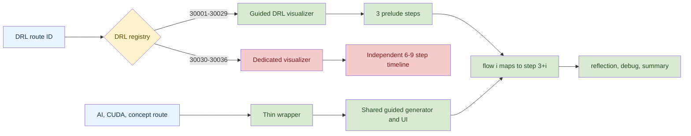

# DRL Blueprints and Guided UI Review

Review snapshot: 2026-08-28 13:18 CST. Scope: DRL IDs 30001-30036, their displayed course data, DRL and generic guided visualizers, wrappers, routing, shared playback state, and relevant tests. This is a read-only review; no source code was changed.

Overall verdict: **FAIL**. The generated DRL contract is sound for IDs 30001-30029, but IDs 30030-30036 bypass it at runtime. Two lessons also contain material semantic errors (30024 and 30028). There are 9 blocker IDs in total.

Rating rule: `公式` covers both the blueprint formula and user-visible equations/claims on the same lesson page. `步骤` passes only when the routed UI exposes one clickable joint per `flow[i]`, with that joint selecting step `3+i`. `PASS-FAIL` is FAIL if any of the five dimensions fails.

## Execution Model

## DRL ID Matrix

| ID | 易读 | 易学 | 易调试 | 公式 | 步骤 | PASS-FAIL | Concise note |
|---:|:---:|:---:|:---:|:---:|:---:|:---:|---|
| 30001 | PASS | PASS | PASS | PASS | PASS | PASS | Return, reward, and discount are clearly separated; four routed joints map correctly. |
| 30002 | PASS | PASS | PASS | PASS | PASS | PASS | Bellman optimality target is sound and the terminal-state debug check is actionable. |
| 30003 | PASS | PASS | PASS | PASS | PASS | PASS | Score-function intuition, gradient sign check, and flow form a coherent lesson. |
| 30004 | PASS | PASS | PASS | PASS | PASS | PASS | TD error and actor/critic responsibilities are correct and easy to inspect. |
| 30005 | PASS | FAIL | PASS | PASS | PASS | FAIL | PUCT is correct, but `c_puct` and parent count `N(s)` are used without symbol explanations. |
| 30006 | PASS | PASS | PASS | PASS | PASS | PASS | On-policy next-action semantics and terminal masking are explicit. |
| 30007 | PASS | PASS | PASS | PASS | PASS | PASS | Off-policy target, behavior/target distinction, and joint mapping are correct. |
| 30008 | PASS | PASS | PASS | PASS | PASS | PASS | n-step target, corrected bias/variance explanation, and worked value are consistent. |
| 30009 | PASS | PASS | PASS | PASS | PASS | PASS | PER probability, importance weight, and corrected priority-ratio example agree. |
| 30010 | PASS | PASS | PASS | PASS | PASS | PASS | Double-DQN selection/evaluation split is semantically correct. |
| 30011 | PASS | PASS | PASS | PASS | PASS | PASS | Mean-centered advantage resolves the `V/A` identifiability issue. |
| 30012 | PASS | PASS | PASS | PASS | PASS | PASS | Action-independent baseline claim and variance-reduction framing are correct. |
| 30013 | PASS | PASS | PASS | PASS | PASS | PASS | Actor and corrected critic update directions both descend their intended losses. |
| 30014 | PASS | PASS | PASS | PASS | PASS | PASS | One-step TD advantage and stop-gradient debug advice are consistent. |
| 30015 | PASS | PASS | PASS | PASS | PASS | PASS | MC versus TD bias/variance comparison is accurate and well staged. |
| 30016 | PASS | PASS | PASS | PASS | PASS | PASS | KL-constrained surrogate and corrected Bernoulli example are consistent. |
| 30017 | PASS | PASS | PASS | PASS | PASS | PASS | Recurrent state, episode reset, truncation, and padding checks are clear. |
| 30018 | PASS | PASS | PASS | PASS | PASS | PASS | Discrete/continuous action-space distinction is concise and accurate. |
| 30019 | PASS | PASS | PASS | PASS | PASS | PASS | Deterministic policy gradient chain rule and exploration caveat are sound. |
| 30020 | PASS | PASS | PASS | PASS | PASS | PASS | Gaussian policy gradient is correct; squash-Jacobian risk is covered by debug guidance. |
| 30021 | PASS | PASS | PASS | PASS | PASS | PASS | Joint-action value and multi-agent non-stationarity are explained coherently. |
| 30022 | PASS | PASS | PASS | PASS | PASS | PASS | CTDE information boundaries are correct and testable. |
| 30023 | PASS | PASS | PASS | PASS | PASS | PASS | Regularized maximum-entropy IRL objective is bounded and the five joints map exactly. |
| 30024 | PASS | FAIL | PASS | FAIL | PASS | FAIL | Blueprint says `D=Pr(expert)`; page objective and `-log D` reward use the opposite convention. |
| 30025 | PASS | PASS | PASS | PASS | PASS | PASS | PPO clip objective and frozen old-log-prob debug check are appropriate. |
| 30026 | PASS | PASS | PASS | PASS | PASS | PASS | Group standardization and corrected `+0.577/-1.732` example agree. |
| 30027 | PASS | PASS | PASS | PASS | PASS | PASS | Leave-one-out baseline excludes the current sample and is directly hand-checkable. |
| 30028 | PASS | FAIL | PASS | FAIL | PASS | FAIL | The page misstates DAPO's four techniques and presents only a clip operator as its loss. |
| 30029 | PASS | PASS | PASS | PASS | PASS | PASS | Monte Carlo estimator, independence caveat, and uncertainty check are correct. |
| 30030 | PASS | PASS | FAIL | PASS | FAIL | FAIL | Routed dedicated UI has 7 steps, no blueprint joints, and no blueprint debug stage. |
| 30031 | PASS | PASS | FAIL | PASS | FAIL | FAIL | Routed dedicated UI has 7 steps and bypasses the four-joint guided contract. |
| 30032 | PASS | PASS | FAIL | PASS | FAIL | FAIL | Routed dedicated UI has 9 steps and bypasses the four-joint guided contract. |
| 30033 | PASS | PASS | FAIL | PASS | FAIL | FAIL | Routed dedicated UI has 7 steps and the blueprint debug checklist is unreachable. |
| 30034 | PASS | PASS | FAIL | PASS | FAIL | FAIL | Dedicated KaTeX renders correctly, but its 7-step UI has no blueprint joint/debug mapping. |
| 30035 | PASS | PASS | FAIL | PASS | FAIL | FAIL | Corrected weighted score is 0.86; the 6-step route still bypasses flow and debug. |
| 30036 | PASS | PASS | FAIL | PASS | FAIL | FAIL | Routed dedicated UI has 6 steps and does not expose the guided four-joint contract. |

Result: **26 PASS, 10 FAIL**. ID 30005 is a non-blocking pedagogy failure; 30024, 30028, and 30030-30036 are blockers.

## BLOCKERS

| No. | Issue title | Suggestion | Code link |
|---|---|---|---|
| B1 | IDs 30030-30036 bypass their blueprints at runtime | Make the guided blueprint the canonical routed implementation, or make each dedicated visualizer consume the same `flow` and `debugTip` contract. Add a route-resolution test that asserts every DRL flow joint is rendered and selects `3+i`. | [registry:11](../../src/problemsdrl/index.ts#L11), [generator:423](../../src/config/drlLessonBlueprints.ts#L423), [click target:154](../../src/components/visualizers/GuidedDRLLessonVisualizer.tsx#L154), [coverage test:101](../../tests/visualizationCoverage.test.ts#L101) |
| B2 | ID 30024 mixes incompatible GAIL discriminator conventions | Pick one convention throughout. With the blueprint's `D=Pr(expert)`, retain `E_exp log D + E_pi log(1-D)` and use `-log(1-D)` (or a clearly labeled `log D` surrogate) for the policy reward. | [blueprint:257](../../src/config/drlLessonBlueprints.ts#L257), [lesson goal:48](../../src/datadrl/imitation.ts#L48), [output:58](../../src/datadrl/imitation.ts#L58) |
| B3 | ID 30028 mischaracterizes DAPO and does not show its policy objective | Replace “Actor and Reference use the same clip” and the KL explanation with the paper's four techniques: Clip-Higher, Dynamic Sampling, Token-Level Policy Gradient Loss, and Overlong Reward Shaping. Show the asymmetric clipped policy objective, not only `clip(r, ...)`. | [blueprint:293](../../src/config/drlLessonBlueprints.ts#L293), [lesson:121](../../src/datadrl/llmrl.ts#L121), [primary DAPO project](https://dapo-sia.github.io/) |

### Routed contract evidence

- The blueprint generator is structurally correct: three prelude steps precede `flow.map`, so `flow[i]` is exactly `steps[3+i]` ([drlLessonBlueprints.ts:423](../../src/config/drlLessonBlueprints.ts#L423)). The DRL and generic renderers jump to that exact index ([GuidedDRLLessonVisualizer.tsx:149](../../src/components/visualizers/GuidedDRLLessonVisualizer.tsx#L149), [GuidedLessonVisualizer.tsx:160](../../src/components/visualizers/GuidedLessonVisualizer.tsx#L160)).
- Browser traversal at 320 px visited every timeline step for all 36 DRL routes. IDs 30001-30029 exposed 4 clickable joints (30023 exposed 5), all with the expected active index and a debug stage. IDs 30030-30036 exposed zero blueprint joints and no debug stage; their routed totals were 7, 7, 9, 7, 7, 6, and 6 steps.

## NON_BLOCKING

| No. | Issue title | Suggestion | Code link |
|---|---|---|---|
| N1 | ID 30005 leaves two PUCT terms undefined | Add symbol entries for exploration coefficient `c_puct` and parent visit count `N(s)`. | [drlLessonBlueprints.ts:83](../../src/config/drlLessonBlueprints.ts#L83) |
| N2 | DRL tests validate the full rhythm on only one ID | Loop the phase-order, exact `steps[3+i]`, debug-stage, and terminal-summary assertions across all 36 IDs. | [drlLessonBlueprints.test.ts:21](../../tests/drlLessonBlueprints.test.ts#L21) |
| N3 | There are no DOM/E2E regressions for the guided interaction contract | Add browser tests for flow clicks, Back/Forward, timeline jumps, route remounts, 320 px overflow, keyboard focus, and accessible names across DRL plus representative AI/CUDA/concept routes. | [fullCourseBlueprints.test.ts:34](../../tests/fullCourseBlueprints.test.ts#L34), [PlaybackControls.tsx:78](../../src/components/controls/PlaybackControls.tsx#L78) |
| N4 | `useVisualization` does not regenerate when `generateSteps` changes | Include generator identity in the regeneration contract, or document/remodel the hook so route keys are not required for correctness. Current route keys prevent stale state in production, but direct prop rerenders remain brittle. | [useVisualization.ts:77](../../src/hooks/useVisualization.ts#L77), [AiProblemPage.tsx:50](../../src/pages/AiProblemPage.tsx#L50), [CudaProblemPage.tsx:51](../../src/pages/CudaProblemPage.tsx#L51), [ConceptDetailPage.tsx:45](../../src/pages/ConceptDetailPage.tsx#L45), [DRLProblemPage.tsx:43](../../src/pages/DRLProblemPage.tsx#L43) |
| N5 | Step changes are visual-only announcements | Put the active step title/phase in an `aria-live="polite"` or `role="status"` region. Controls have names, focus rings, progress semantics, and `aria-current`, but screen-reader users are not notified when content changes. | [GuidedLessonVisualizer.tsx:95](../../src/components/visualizers/GuidedLessonVisualizer.tsx#L95), [GuidedDRLLessonVisualizer.tsx:89](../../src/components/visualizers/GuidedDRLLessonVisualizer.tsx#L89) |
| N6 | Timeline declares `role=list` with buttons as direct children | Remove the list role or wrap each button in a `role=listitem`/`li` so ARIA ownership is valid. | [PlaybackControls.tsx:147](../../src/components/controls/PlaybackControls.tsx#L147) |
| N7 | DRL duplicates the generic schema, generator, and renderer | Move DRL onto `GuidedLessonBlueprint` and the shared renderer after reconciling its route overrides. This reduces drift in phase order, accessibility, and test behavior. | [drlLessonBlueprints.ts:1](../../src/config/drlLessonBlueprints.ts#L1), [guidedLessonTypes.ts:1](../../src/config/guidedLessonTypes.ts#L1) |

## Generic AI/CUDA/Concept Guided UI

| Area | Correctness | Readability | Debuggability | Assessment |
|---|:---:|:---:|:---:|---|
| Shared types and generator | PASS | PASS | PASS | One explicit schema generates intuition, symbols, formula, one transition per flow joint, misconception, debug, and summary. |
| AI wrapper and 63 fallback lessons | PASS | PASS | PASS | Wrapper only resolves route ID and blueprint; shared UI owns behavior consistently. |
| CUDA wrapper and 21 fallback lessons | PASS | PASS | PASS | Same thin-wrapper contract; no domain-specific state fork was found. |
| Concept wrapper and 36 lessons | PASS | PASS | PASS | Same contract, with route-key remount and complete blueprint coverage. |
| Interaction state | PASS | PASS | PASS | Flow click, Back, Forward, reset/timeline, and autoplay bounds share one control path. N4 remains a latent API issue. |
| Tests | PASS | PASS | FAIL | Data completeness and KaTeX parsing are broad, but tests do not render DOM or exercise route transitions and accessibility. |

The wrappers are appropriately small ([AI](../../src/components/visualizers/GuidedAILessonVisualizer.tsx#L1), [CUDA](../../src/components/visualizers/GuidedCudaLessonVisualizer.tsx#L1), [concept](../../src/components/visualizers/GuidedConceptLessonVisualizer.tsx#L1)). The generic generator's index layout is explicit ([guidedLessonTypes.ts:41](../../src/config/guidedLessonTypes.ts#L41)), and all three page families key the resolved visualizer by route ID, preventing stale lesson state on navigation.

The generic tests cover all 63 AI, 21 CUDA, and 36 concept blueprints, validate required fields, KaTeX syntax, transition counts, active indices, and terminal summaries ([fullCourseBlueprints.test.ts:22](../../tests/fullCourseBlueprints.test.ts#L22)). The static KaTeX scanner also covers formula/symbol properties and literal `MathText` segments ([katexSources.test.ts:127](../../tests/katexSources.test.ts#L127)). These are valuable data-contract tests, but none mounts React or proves the click/remount/mobile behavior.

## Verification

| Check | Result |
|---|---|
| KaTeX strict render | PASS for all static blueprint formulas/symbols and scanned visualizer math. Semantic failures above are content errors, not parser errors. |
| Exact flow mapping | PASS in generated data for all 36 DRL and all 120 generic blueprints; PASS in routed UI for DRL 30001-30029; FAIL for routed DRL 30030-30036. |
| `3+i` click target | PASS in source and browser for DRL, AI, CUDA, and concept guided renderers. |
| Back/Forward/timeline | PASS in browser on representative DRL, AI, CUDA, and concept routes. |
| Route remount | PASS: each family reset to step 0 after navigating to the next ID. |
| Mobile overflow | PASS: every step of every DRL route fit at 320 px and 375 px; representative AI/CUDA/concept routes also fit at 320 px. Horizontal formula/flow/timeline regions scroll locally. |
| Basic accessibility | PASS for control names, progressbar, focus rings, `aria-pressed`, and `aria-current`; N5-N6 remain. |
| Console | PASS: no browser console errors during the routed interaction checks. |
| Automated suite | `npm test`: 19/19 PASS. `npm run build`: PASS. `npm run lint`: PASS. |

The requested independent-validator API was not available in this session. Findings were therefore revalidated through two separate local passes: static source/data derivation and a real headless-Chrome route sweep. The primary-source web search endpoint failed, so DAPO was checked against its official project page directly.

## Final Assessment

Do not sign off the DRL guided rollout until B1-B3 are closed. The shared AI/CUDA/concept architecture is otherwise coherent and manually behaves correctly, but it needs DOM-level regression coverage before interaction and accessibility guarantees are durable.

## 最终阻断项关闭复核

复核时间：2026-08-28 13:39 CST。范围仅限此前阻断项及用户点名的 30005、全 36 题步骤契约与无障碍修复。

结论：**PASS，BLOCKERS = 0**。

- **30024 GAIL：关闭。** `D(s,a)` 始终表示“来自专家的概率”；目标统一为 `E_exp[log D] + E_pi[log(1-D)]`，策略奖励统一为 `-log(1-D)`，数据页、blueprint 与 flow 一致。
- **30028 DAPO：关闭。** 页面与 blueprint 均准确列出 Clip-Higher、Dynamic Sampling、Token-Level Policy Gradient Loss、Overlong Reward Shaping；目标函数包含非对称裁剪及按整批有效 token 总数归一化。
- **30030-30036 路由：关闭。** DRL 专用注册表为空，全部路由统一进入 `GuidedDRLLessonVisualizer`；每个 `flow[i]` 都由原生按钮跳转至 `3+i`，并可到达独立 debug 阶段。
- **30005 PUCT：关闭。** `N(s)`、`N(s,a)` 与 `c_{puct}` 均有明确符号释义。
- **36 题步骤契约与无障碍：关闭。** 全部课程均满足 `intuition -> symbols -> formula -> 每个 flow 关节 -> reflection -> debug -> summary`；步骤变化有 `aria-live`，flow/播放/时间线控件具有原生按钮、可访问名称、状态与合法 navigation 语义。

最小验证：`node --experimental-strip-types --test tests/drlLessonBlueprints.test.ts tests/drlExamples.test.ts tests/visualizationCoverage.test.ts`，**6/6 PASS**；`./node_modules/.bin/tsc --noEmit`，**PASS**。本轮未能重复浏览器遍历：沙箱拒绝本地端口监听，Playwright MCP 缺少浏览器扩展；关闭结论由运行时路由链源码、逐关节点击实现及上述契约测试交叉确认。
